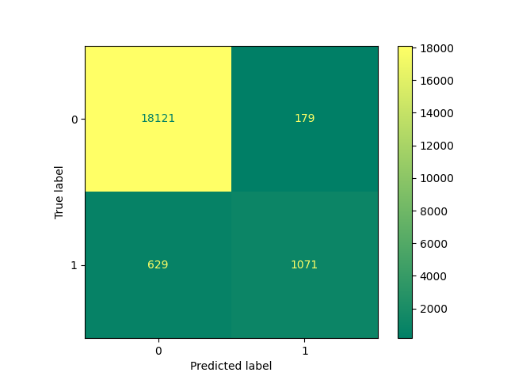
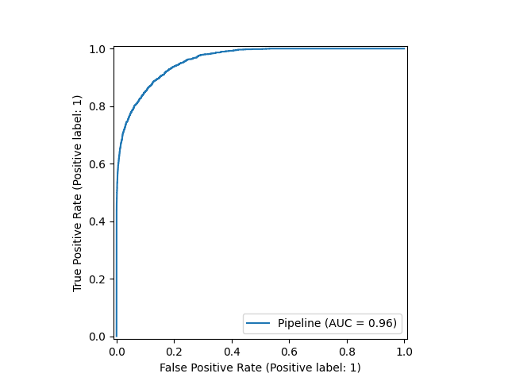
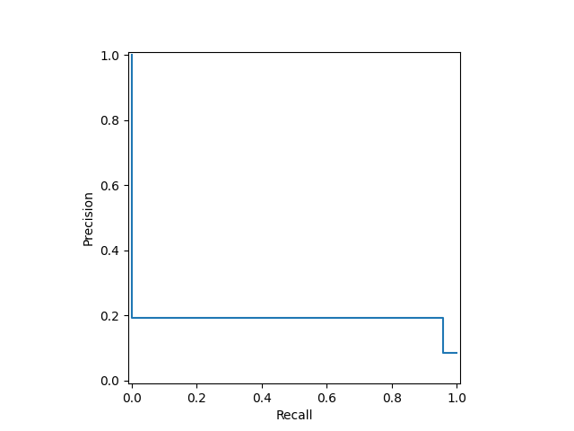

# Diabetes Prediction

### Problem
This is a classification problem where the model predicts whether a person has diabetes or not,
based on given demographic and health information.

### Data
The data corresponds to demographic and health information.

| Variables           | Description                                                     |
|---------------------|-----------------------------------------------------------------|
| gender              | Biological sex (Male/Female/Other)                              |
| age                 | Person's Age                                                    |
| hypertension        | History of hypertension? (Y/N)                                  |
| heart_disease       | History of heart disease? (Y/N)                                 |
| smoking_history     | Smoking history (not current/former/No Info/current/never/ever) |
| bmi                 | Body Mass Index (BMI)                                           |
| HbA1c_level         | Average blood sugar level over the past 2-3 months              |
| blood_glucose_level | Blood sugar level                                               |
| diabetes            | Does this person have diabetes? (0: No, 1: Yes)                 |

Source: Kaggle

## Model performance

|            | Train  | Test   |
|------------|--------|--------|
| Precision  | 0.8675 | 0.8568 |
| Recall     | 0.6292 | 0.63   |
| F1 Score   | 0.7294 | 0.7261 |

### Confusion Matrix

### ROC Curve (with AUC score)

### Precision-Recall (PR) curve

