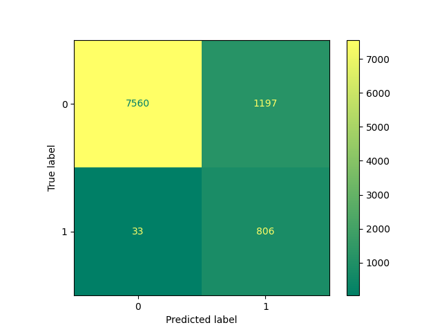
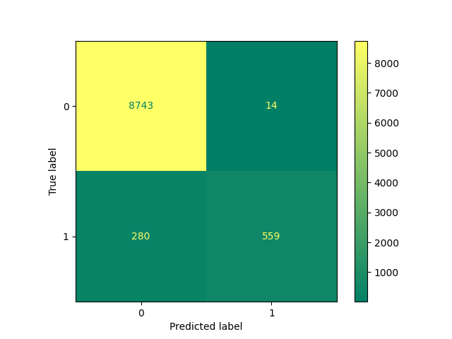
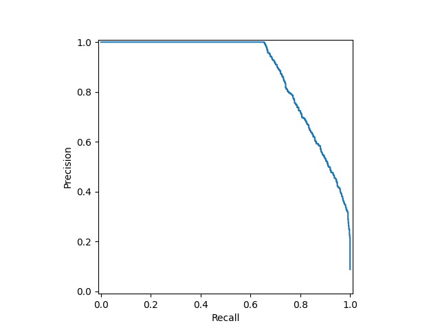
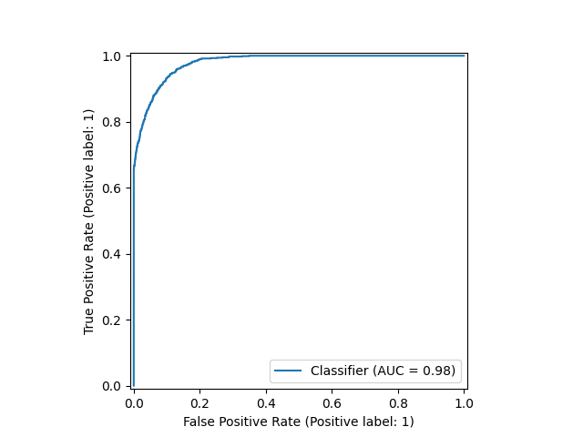
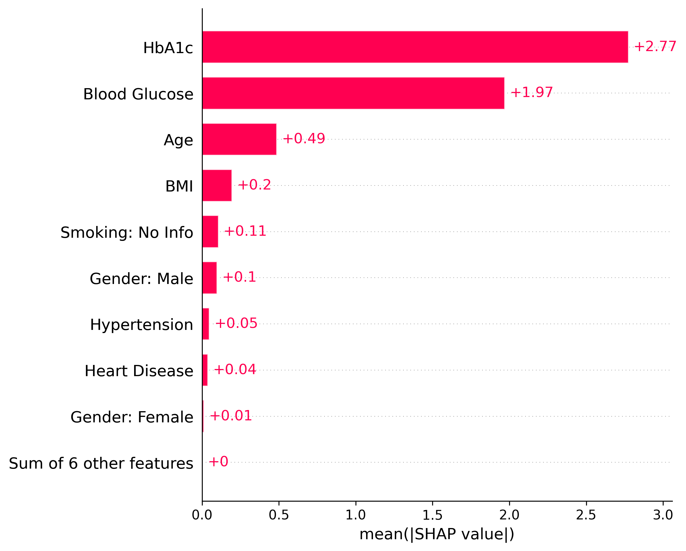
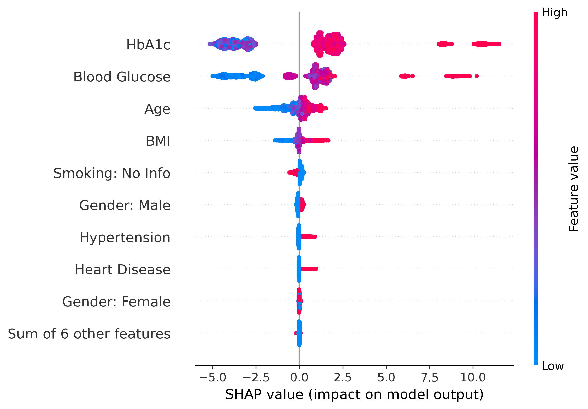
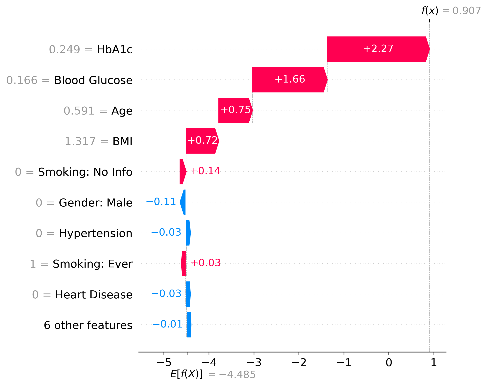

# Diabetes Prediction

## Project Overview

This project demonstrates an end-to-end machine learning workflow for a
binary medical screening task using the Diabetes Prediction dataset.

The system is designed to support **two distinct operational policies**:
1. **Triage mode** – high-recall early screening
2. **Balanced mode** – precision-oriented follow-up assessment

The project emphasizes:
- Explicit business-driven evaluation criteria
- Proper dataset hygiene and leakage prevention
- Threshold-aware model selection
- Reproducible experimentation with MLflow and DVC
- Production-ready deployment with FastAPI, Streamlit, and Docker

## Business Framing

Rather than optimizing a single metric, this project models two real-world
decision policies:

### 1. Triage Policy (Early Screening)
- Goal: Minimize false negatives
- Constraints:
  - Recall ≥ 0.96
  - Precision ≥ 0.25
- Use case: Initial risk screening where missing a positive case is costly

### 2. Balanced Policy (Follow-up Assessment)
- Goal: Balanced decision quality
- Constraint:
  - F1 ≥ 0.68
- Use case: Secondary evaluation to reduce unnecessary follow-ups

Both policies are served by the same trained model using **different probability thresholds**.

## Dataset

- Source: [Diabetes Prediction Dataset](https://www.kaggle.com/datasets/iammustafatz/diabetes-prediction-dataset)
- Task: Binary classification
- Samples: 100,000 (before cleaning)
- Features: 8 input features + 1 target
- Feature types:
  - Numerical
  - Categorical
  - Binary

| Feature              | Description                                                     |
|----------------------|-----------------------------------------------------------------|
| gender               | Biological sex (Male/Female/Other)                              |
| age                  | Person's Age                                                    |
| hypertension         | History of hypertension? (0: No, 1: Yes)                        |
| heart_disease        | History of heart disease? (0: No, 1: Yes)                       |
| smoking_history      | Smoking history (not current/former/No Info/current/never/ever) |
| bmi                  | Body Mass Index (BMI)                                           |
| HbA1c_level          | Average blood sugar level over the past 2-3 months              |
| blood_glucose_level  | Blood sugar level                                               |
| diabetes             | Does this person have diabetes? (0: No, 1: Yes)                 |

A full model card describing dataset provenance, intended use,
and limitations is included in the repository.

## Data Ingestion & Validation

Initial raw data analysis revealed several quality issues:

- Duplicate records
- Conflicting labels
- Class imbalance

Cleaning steps:
- Removed duplicates: 100,000 → 96,146
- Removed label conflicts: 96,146 → 95,964

The cleaned dataset was split into:
- Train: 80%
- Validation: 10%
- Test: 10%

All dataset splits are:
- Logged in MLflow
- Versioned and frozen using DVC

## Exploratory Data Analysis (Minimal)

EDA was intentionally limited to the **training set only** to avoid data leakage.

Key observations:
- Mixed feature types (numerical, categorical, binary)
- No missing values
- Mild skewness observed in BMI
- Categorical cardinality remained manageable

No feature pruning or transformation decisions were made at this stage.

## Baseline Model

A Gaussian Naive Bayes model was used as a performance baseline.

Evaluation:
- Stratified 10-fold cross-validation (train set only)
- Metrics reported as mean ± std

Results:
- Recall: 0.9684 ± 0.0066
- Precision: 0.1871 ± 0.0022
- F1: 0.3136 ± 0.0031

The baseline confirmed that high recall is achievable, but at the cost of poor precision.

## Model Shortlisting

Multiple candidate models were evaluated using consistent
cross-validation and class-balancing strategies:

- Logistic Regression
- Nystroem + Linear SVM
- Random Forest
- HistGradientBoosting
- KNN

Evaluation focused on recall, precision, and F1 stability.

| Model                 | CV Recall          | CV Precision       | CV F1 Score        |
|-----------------------|--------------------|--------------------|--------------------|
| Logistic Regression   | 0.8841 ± 0.0097    | 0.4356 ± 0.0123    | 0.5836 ± 0.0111    |
| Nystroem + Linear SVM | 0.9096 ± 0.0096    | 0.4493 ± 0.0079    | 0.6014 ± 0.0071    |
| Random Forest         | 0.6954 ± 0.0155    | 0.9515 ± 0.0105    | 0.8034 ± 0.0102    |
| HistGradientBoosting  | 0.9126 ± 0.0109    | 0.5037 ± 0.0108    | 0.649 ± 0.0089     |
| KNN                   | 0.6161 ± 0.0137    | 0.8864 ± 0.0111    | 0.7268 ± 0.0091    |

## Hyperparameter Tuning

Two complementary models were selected for tuning:
- Logistic Regression (linear, interpretable)
- HistGradientBoosting (non-linear, expressive)

Both were optimized using PR-AUC, a threshold-independent metric
appropriate for imbalanced classification.

Best results:
- Logistic Regression PR-AUC: 0.8242
- HistGradientBoosting PR-AUC: 0.8928

## Threshold Analysis & Operating Points

Instead of relying on default thresholds, model behavior was analyzed
across probability thresholds using the validation set.

Each model was evaluated against both operational policies.

Final operating points:
- Baseline model
  - Triage mode : not supported
  - Balanced mode
    - threshold = 0.9964
    - F1 = 0.5543
- HistGradientBoosting model
  - Triage mode
    - threshold = 0.3631
    - Recall = 0.9607
    - Precision = 0.3967
  - Balanced mode
    - threshold = 0.8871
    - F1 = 0.8256
- LogisticRegression model
  - Triage mode
    - threshold = 0.2795
    - Recall = 0.9607
    - Precision = 0.3073
  - Balanced mode
    - threshold = 0.8967
    - F1 = 0.7502

## Final Evaluation

The HistGradientBoosting model was selected for deployment.

Final performance on the held-out test set:

### Triage Mode
- Recall: 0.9607
- Precision: 0.4024
- F1: 0.5672

### Balanced Mode
- Recall: 0.6663
- Precision: 0.9756
- F1: 0.7918

All results generalize consistently from validation to test,
indicating stable model behavior.

### Confusion Matrix

**Triage mode**

**Balanced mode**

### PR Curve

### ROC Curve

## Experiment Tracking & Reproducibility

- All experiments tracked in MLflow
- Metrics, parameters, artifacts fully logged
- Final model registered in MLflow Model Registry
- Dataset splits versioned with DVC

## Deployment

The system is deployed locally using:

- FastAPI for inference
- Streamlit for user interaction
- Docker & Docker Compose

The inference API supports both operating modes via a query parameter.
Models are loaded from frozen artifacts exported from MLflow.

## Model Explainability (SHAP)

**Note:** SHAP explanations are computed on the model's transformed feature space after preprocessing.
Categorical variables are one-hot encoded and numerical variables are standardized by the same fitted
preprocessing pipeline used during training.

### Summary / Feature Importance Plot

### Beeswarm Plot

### Waterfall Plot (Test Set Example @349)

### Conclusion

SHAP analysis shows that the model's predictions are driven primarily by **HbA1c** and **Blood Glucose**,
followed by **Age** and **BMI**. This aligns well with established medical knowledge about diabetes risk
factors.

Local explanations further demonstrate how individual features contribute to a prediction, allowing clinicians
to understand why the model considered a specific patient to be at high or low risk.

The explanations remain the same regardless of the chosen operating threshold (triage or balanced),
since SHAP explains the model's estimated probability rather than the downstream decision policy.

## Future Improvements

- Monitoring with Prometheus & Grafana
